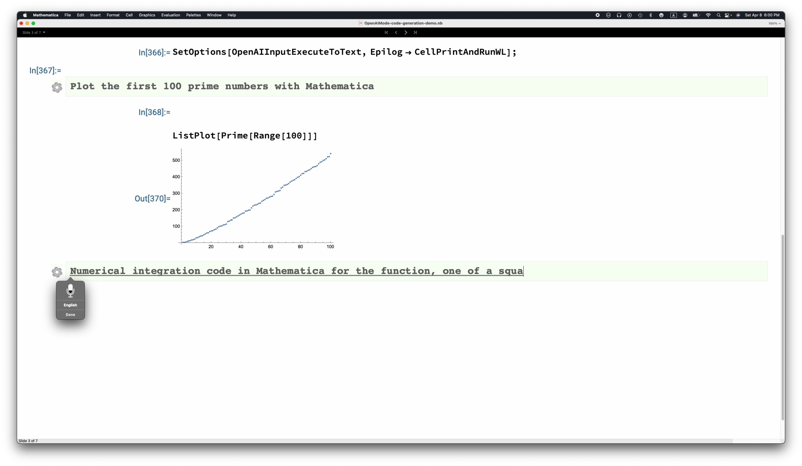

# OpenAIMode WL paclet

## Introduction

This repository has the code and documentation of Wolfram Language (WL) (aka Mathematica) 
paclet that provides a notebooks style with 
[OpenAI](https://platform.openai.com)
interaction cells.

It is assumed that the user of this paclet has:

- An [OpenAI](https://platform.openai.com) account (i.e. authorization token)
- Installed the [paclet "OpenAILink"](https://resources.wolframcloud.com/PacletRepository/resources/ChristopherWolfram/OpenAILink/)
- Followed the [setup steps of "OpenAILink"](https://resources.wolframcloud.com/PacletRepository/resources/ChristopherWolfram/OpenAILink/tutorial/ConfiguringOpenAICredentials.html)

## Installation

1. Install the 
[paclet "OpenAILink"](https://resources.wolframcloud.com/PacletRepository/resources/ChristopherWolfram/OpenAILink/)
and follow the setup steps.

```mathematica
PacletInstall["ChristopherWolfram/OpenAILink"]
```

2. Install the
[paclet "OpenAIMode"](https://resources.wolframcloud.com/PacletRepository/resources/AntonAntonov/OpenAIMode/).

```mathematica
PacletInstall["AntonAntonov/OpenAIMode"]
```

-----

## Getting completions (answers) and images

This screenshot should give a good idea of paclet's utility:


See the demo video ["OpenAIMode demo (Mathematica)"](https://www.youtube.com/watch?v=htUIOqcS9uA).

The corresponding
[presentation notebook](https://community.wolfram.com/groups/-/m/t/2864162)
can be obtained from [Community.wolfram.com](https://community.wolfram.com).

Here are the corresponding slides (in Markdown):
["OpenAIMode-demo.md"](https://github.com/antononcube/MathematicaForPrediction/blob/master/MarkdownDocuments/OpenAIMode-demo.md).

------

## Streamlined code generation and execution

Code generation and execution can be streamlined using the option `Epilog` and the
constellation of the paclet functions `CellPrint*`.

This screenshot shows code generation and execution using voice dictation:



See the code generation demo video
["OpenAIMode code generation workflows demo (Mathematica et al.)"](https://www.youtube.com/watch?v=PGOtCWJgZEs).

The corresponding
[presentation notebook](https://community.wolfram.com/groups/-/m/t/2864162)
can be obtained from [Community.wolfram.com](https://community.wolfram.com).

-----

## Flowchart

This flowchart shows the execution steps while using "OpenAIMode":

```mermaid
flowchart TD
OpenAI{{OpenAI}}
OpenAILink[[" OpenAILink"]]
TCC["Text completion cell"]
IGC["Image generation cell"]
OIE["OpenAIInputExecute"]
OC["Output cell"]
UI[/"User input"/]
UI --> TCC
UI --> IGC
TCC -.-> OpenAIInputExecuteToText -.-> OIE
IGC -.-> OpenAIInputExecuteToImage -.-> OIE
OIE -.-> OpenAILink
OpenAILink <-.-> OpenAI
OpenAILink -.-> OC
TCC --> OC
IGC --> OC
subgraph Notebook
        TCC
		OpenAIInputExecuteToText
        IGC
		OpenAIInputExecuteToImage
		OIE
        OC
end   
```
